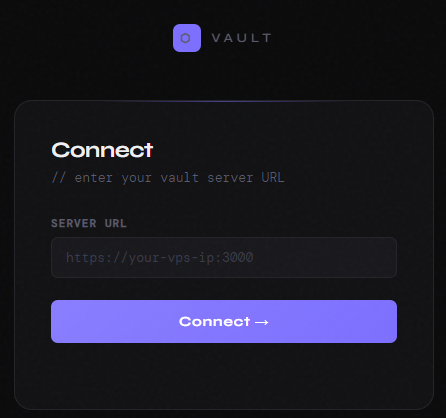
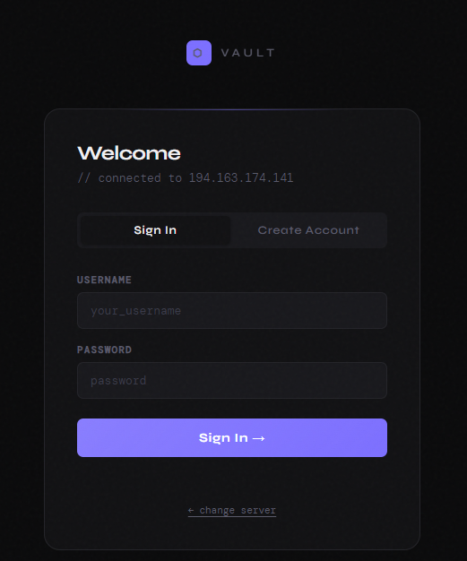
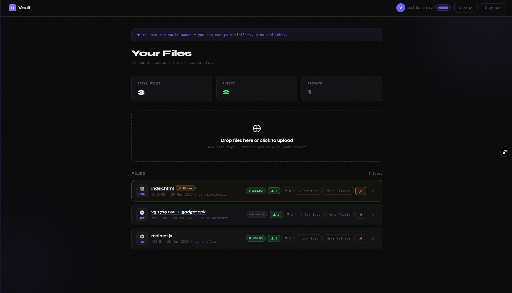
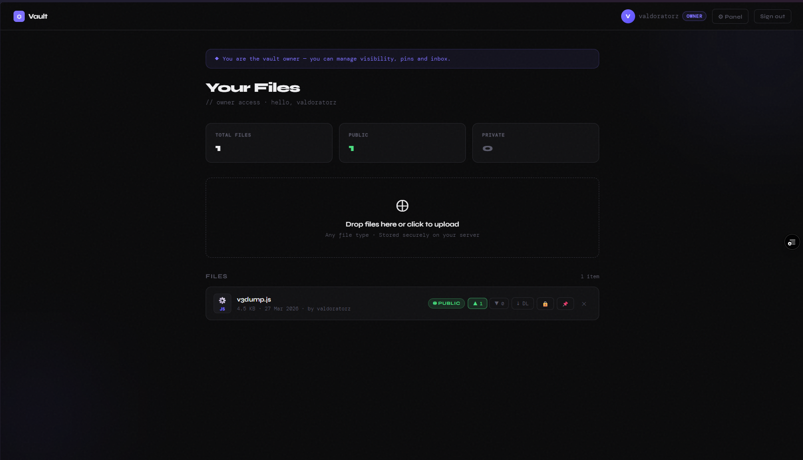
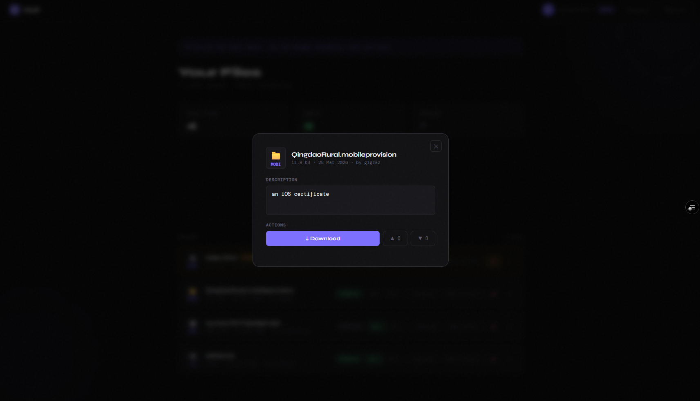
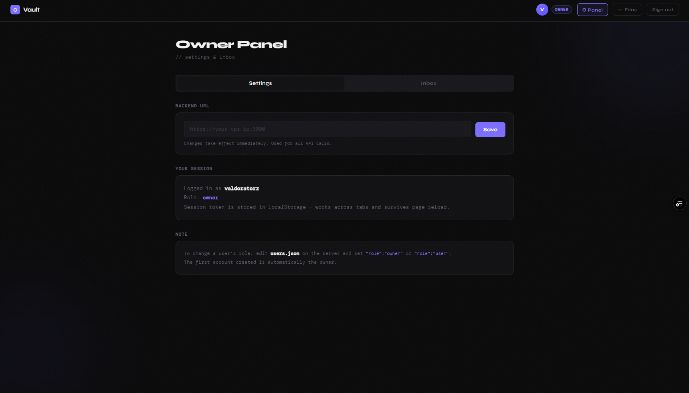
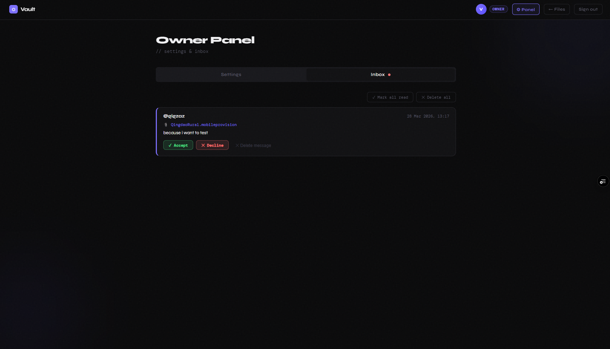

# ⬡ Vault

> A self-hosted, minimalist file storage platform with real authentication, owner permissions, upvotes, pins, inbox, and HTTPS support.

---

## Screenshots

<p align="center">
  
  &nbsp;&nbsp;
  
</p>

<p align="center"><em>Connect to your server → Sign in or create an account</em></p>

---

<p align="center">
  
</p>

<p align="center"><em>Owner dashboard — manage visibility, pins, upvotes, and downloads</em></p>

---

<p align="center">
  
</p>

<p align="center"><em>Files view showing public/private status, upvote counts, and download tracking</em></p>

---

<p align="center">
  
</p>

<p align="center"><em>File detail modal — description, download, and vote actions</em></p>

---

<p align="center">
  
</p>

<p align="center"><em>Owner Panel › Settings — configure your backend URL and view session info</em></p>

---

<p align="center">
  
</p>

<p align="center"><em>Owner Panel › Inbox — accept or decline file upload requests from users</em></p>

---

## Features

- **authentication** — SHA-256 hashed passwords stored server-side in `users.json`
- **owner system** — first account created is permanently the owner
- **public / Private files** — only the owner can toggle visibility
- **pins** — owner can pin important files to the top
- **upvotes / Downvotes** — per-file community voting
- **inbox** — users send upload requests to the owner with a reason; owner accepts or declines
- **download tracking** — download count displayed per file
- **HTTPS support** — self-signed cert via OpenSSL, or run behind a reverse proxy
- **single `index.html` frontend** — host on GitHub Pages, Vercel, or any static host

---

## Stack

| Layer | Tech |
|---|---|
| Frontend | Vanilla HTML / CSS / JS (single file) |
| Backend | Node.js + Express |
| File storage | Local disk (`/files`) |
| Database | `db.json` (flat-file JSON) |
| Auth store | `users.json` |
| Deps | `express` `multer` `cors` `uuid` |

---

## How to Start it

### 1. Clone & install

```bash
git clone https://github.com/valdoratorz/vault
cd vault
npm install express multer cors uuid
```

### 2. Generate a self-signed HTTPS certificate

```bash
openssl req -x509 -newkey rsa:2048 \
  -keyout key.pem -out cert.pem \
  -days 3650 -nodes -subj "/CN=localhost"
```

> Skip this step if you're running behind a reverse proxy (nginx / Caddy). Set `USE_HTTPS=false` instead.

### 3. Configure environment variables

| Variable | Default | Description |
|---|---|---|
| `PORT` | `3000` | Port the server listens on |
| `API_KEY` | `g#7Kp!2Zx@L9$QvR` | Shared secret between frontend and backend — **change this** |
| `FRONTEND_URL` | `https://neval.vercel.app` | Your frontend origin (for CORS) |
| `USE_HTTPS` | `true` | Set to `false` to run plain HTTP |


### 4. Host the frontend

Upload `index.html` to **GitHub Pages**, or any static host.

On first load, enter your server URL (e.g. `https://1.1.1.1:3000`). This is saved locally and used for all API calls.

### 5. Create your owner account

The **first account to sign up** is automatically assigned the `owner` role and gains access to:
- File visibility controls (public / private)
- Pin management
- The Owner Panel (settings + inbox)

To manually promote a user to owner, edit `users.json` on the server:

```json
{ "username": "yourname", "role": "owner", ... }
```

---

## File Structure

```
vault/
├── server.js          # Express backend
├── web/
    └── index.html     # Frontend (single file)
├── users.json         # User accounts + hashed passwords
├── files/             # Uploaded file storage (auto-created)
├── cert/
    ├── cert.pem           # TLS certificate
    └── key.pem            # TLS private key
├── package-lock.json
├── LICENSE
└── Screen/
```

---

## Security Notes

- Passwords are hashed with **SHA-256** before storage — never stored in plaintext
- The `API_KEY` env var is required for all mutating API requests — change the default before deploying
- `users.json` and `db.json` are never served as static files
- Running behind **nginx** or **Caddy** with a proper TLS cert is recommended over the self-signed certificate in production

---

## License

See [LICENSE](./LICENSE).